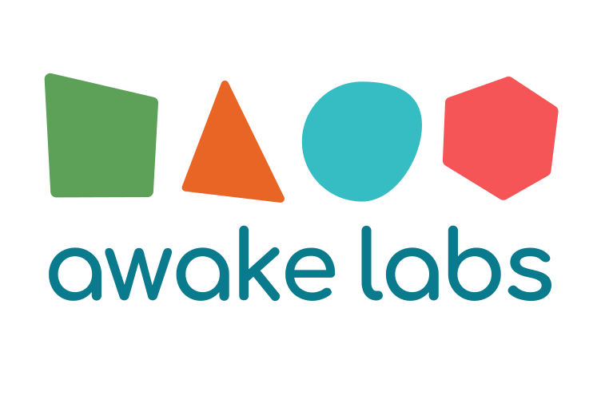

<!--  -->


# Quality Assurance Internship Coding Challenge

## Installation
This project uses Pipenv for local development. Please refer to the Resources section if you are unfamiliar with how to instantiate a Pipenv environment.
```
pipenv install
```

## Run Project
Flask API:
```
make
```
Navigate to http://localhost:3335/docs to view all the API endpoints and their signatures in Swagger UI.

MongoDB Docker container:
```
make db
```

Run tests and print coverage:
```
make test
```

## Background
This coding challenge involves writing a set of unit and integration tests for a Python Flask API which handles user documents in a MongoDB docker container.

User documents consist of the following structure:
```
{
    _id: ObjectId,
    client_code: string,
    organization: string
}
```

It is essential that API routes are tested so that future changes can be verified for the integrity of business logic. (and not break stuff!)

We encourage you to write tests to the best of your ability and submit any work you do, regardless of progress.

---

## Project Structure
### Main
The [/app/main.py](/app/main.py) file is the entry point for the app, containing a Flask API object, CORS rules, a user router, and a `/health/check` route used to verify that the API is running externally. Please write a unit test to verify that this route works.

### Controllers
There are four basic routes for CRUD operations within the [/app/controllers.py](/app/controllers.py) file. Each of these routes will need integration tests to verify that asynchronous database calls via their service functions are working properly.

### Services
The [/app/services.py](/app/services.py) file contains four functions for performing business logic. Each function corresponds to a controller route to handle imperitive business logic. Each of these functions will need to be unit tested independent of controllers.

### Mongo Client
The [/app/mongo_client.py](/app/mongo_client.py) file contains a singleton instance of a MongoDB client. We've exported a `users_collection` object from this file which is used to perform database operations within [services.py](/app/services.py).

### Docker Compose
The [./docker-compose.yaml](./docker-compose.yaml) file defines how the local MongoDB instance will be instantiated. We encourage you to understand how this file works.

### Makefile
The [./Makefile](./Makefile) file contains three basic commands:
- `make`: Run the Python Flask app
- `db`: Run the MongoDB Docker container
- `test` Run all tests within the project and print a coverage report to the console.

Please familiarize yourself with how this file works. Feel free to adjust it as you see fit.

---

## Requirements
The objective of this challenge is to write integration and unit tests for a Python Flask API which handles users in a MongoDB database.

The `test` command in the make file will print a test coverage report to determine how well you have implemented tests in the project. Controllers, Services, and the Main entry point should be covered. Additional coverage will be taken into consideration.

We encourage you to familiarize yourself with packages installed in the `Pipfile`, however the `pytest` package is the most important. Feel free to install additional packages as you see fit.

---

## Deliverables
Please upload your project to a Github repository and provide the link in your follow up with the hiring team so that it can be cloned for assessment.

---

## Resources

In addition to the following resources, feel free to reach out if you have any questions. We work as a team and are happy to provide assistance where appropriate.

Docker:
> https://docs.docker.com/get-docker/

Docker and MongoDB:
> https://www.mongodb.com/compatibility/docker

Pymongo:
> https://pymongo.readthedocs.io/en/stable/

Pytest:
> https://docs.pytest.org/en/7.3.x/

FastAPI:
> https://fastapi.tiangolo.com/tutorial/

Pipenv:
> https://pipenv.pypa.io/en/latest/

## Happy Coding!
### - Awake Labs Dev Team